```html
<div align="center">
  <pre>
   █████╗ ███████╗██╗     ███████╗███╗   ██╗███████╗
  ██╔══██╗╚══███╔╝██║     ██╔════╝████╗  ██║██╔════╝
  ███████║  ███╔╝ ██║     █████╗  ██╔██╗ ██║███████╗
  ██╔══██║ ███╔╝  ██║     ██╔══╝  ██║╚██╗██║╚════██║
  ██║  ██║███████╗███████╗███████╗██║ ╚████║███████║
  ╚═╝  ╚═╝╚══════╝╚══════╝╚══════╝╚═╝  ╚═══╝╚══════╝
              The context compression layer for AI agents
</pre>
</div>
```

# MCP Multi-Server Workspace

**AzLens** is a TypeScript monorepo of three decoupled [Model Context Protocol](https://modelcontextprotocol.io) servers plus a ChatGPT-style web UI, deployable end-to-end to **Azure Container Apps** with a single GitHub Actions workflow.

| Component                | Type        | Purpose                            | Tools / Role                                                                                                   |
| ------------------------ | ----------- | ---------------------------------- | -------------------------------------------------------------------------------------------------------------- |
| `mcp-local-coder`        | MCP server  | Local file system + code search    | `read_file`, `write_file`, `search_code`, `list_directory`                                                     |
| `AzLens-mcp`             | MCP server  | Azure ARM / KQL / Wiki             | `query_azure_resource`, `run_kql_query`, `search_wiki`                                                         |
| `mcp-personal-assistant` | MCP server  | Notes + to-do lists                | `get_daily_notes`, `update_todo_list`                                                                          |
| `mcp-github`             | MCP server  | GitHub repos / issues / PRs / code | `search_repositories`, `get_repository`, `list_issues`, `get_issue`, `list_pull_requests`, `get_file_contents` |
| `chat-ui`                | Next.js app | ChatGPT-style front end            | Multi-provider LLM + MCP client over all four servers                                                          |

Each MCP server ships **two transports** from a single codebase:

- **stdio** (`build/index.js`) — for locally-spawned clients (Claude Desktop, VS Code).
- **Streamable HTTP** (`build/http.js`) — for remote hosting on Azure Container Apps.

## Chat UI

A modern, claude.ai-style front end with a collapsible sidebar, **New chat**, search, and multiple conversations you can switch between (persisted in the browser). Each conversation streams responses from your chosen model and can call the MCP tools.

Highlights: **multi-provider models** (Azure OpenAI / OpenAI / Anthropic / local LM Studio-style servers) with an **Auto router** that sends simple prompts to a cheap model and complex ones to a powerful model; switchable **agents** (General / Code / Azure / Personal Assistant), each scoped to the right MCP servers; **tool approval** for mutating tools; **stop / regenerate / copy / edit-and-resend**; **dark mode**; an **MCP tools health panel** (live online/offline dots); chat **rename** + date grouping; markdown rendering; file/image attachments; and a **⌘K command palette**.

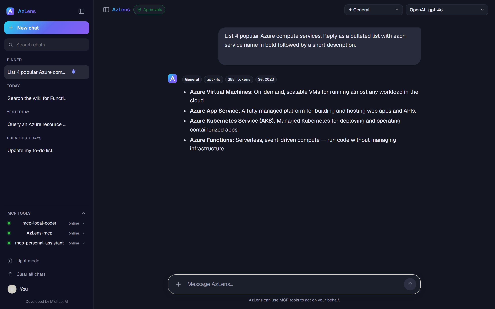

The **⌘K command palette** — jump between chats or run actions:

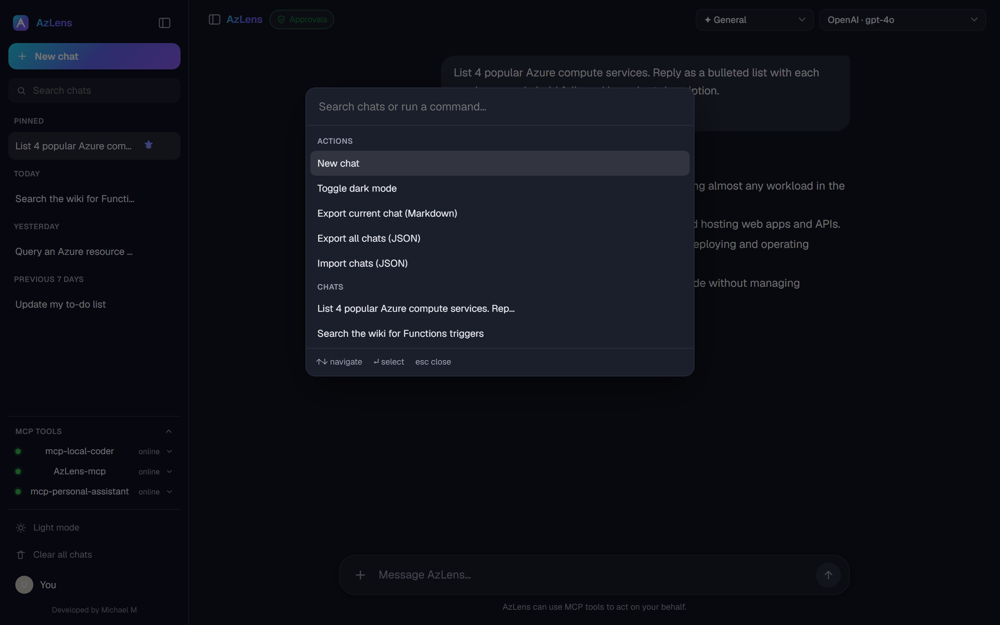

Collapsing the sidebar leaves a slim **icon rail** (new chat, search, theme):

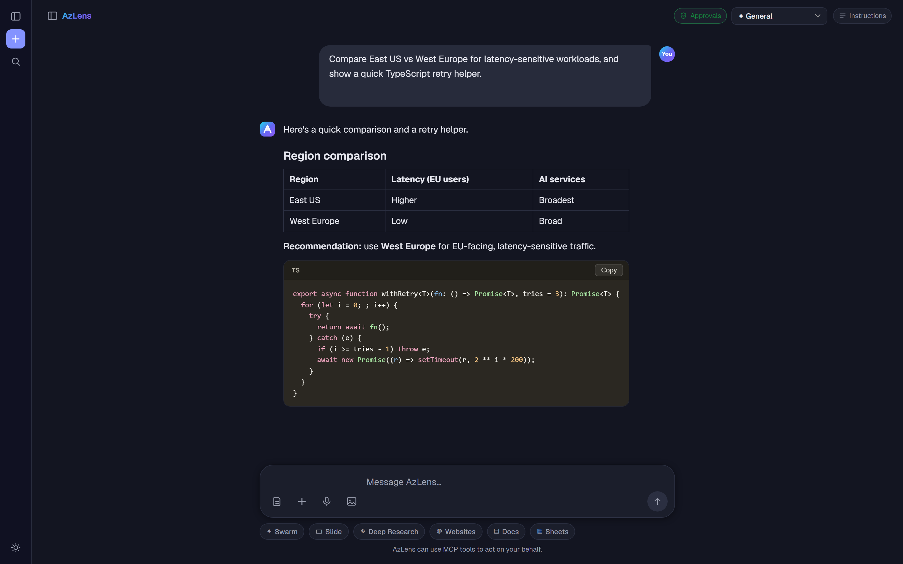

<details>
<summary>Light mode</summary>

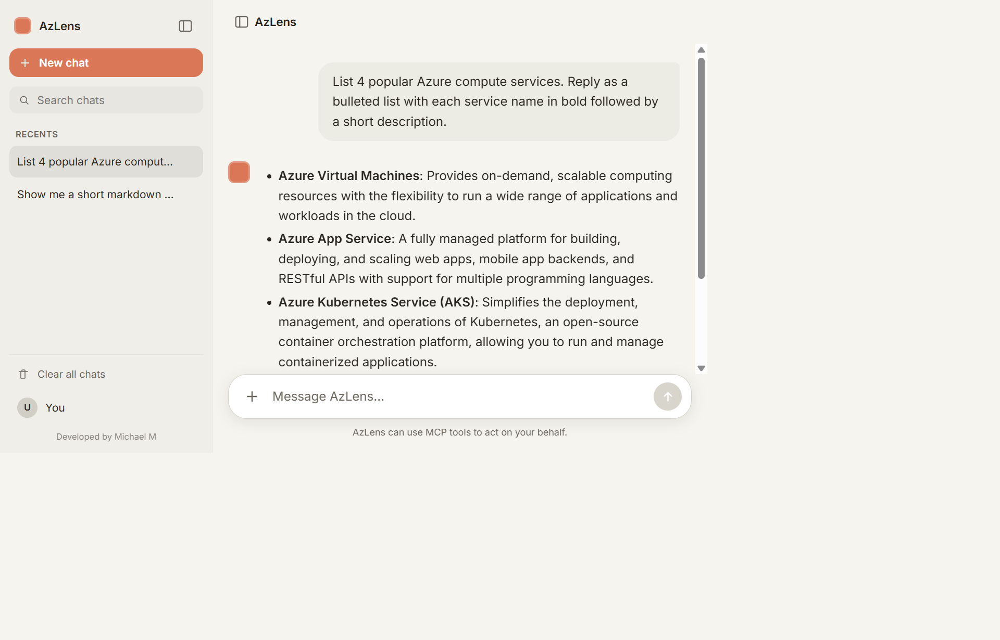

</details>

---

## Table of contents

- [Architecture](#architecture)
- [Repository layout](#repository-layout)
- [Prerequisites](#prerequisites)
- [Quick start (local)](#quick-start-local)
- [Running & testing locally (step by step)](#running--testing-locally-step-by-step)
- [Configuration reference](#configuration-reference)
- [Deploy to Azure](#deploy-to-azure)
  - [One-time setup](#step-1--one-time-azure-setup-oidc)
  - [chat-ui secrets](#step-2--chat-ui-secrets-azure-openai--entra)
  - [Run the deployment](#step-3--run-the-deployment)
  - [Post-deploy configuration](#step-4--post-deploy-configuration)
- [Manual deploy](#manual-deploy-without-github-actions)
- [Tools reference](#tools-reference)
- [Chat UI functionality](#chat-ui-functionality)
- [How it works](#how-it-works)
- [Tooling & quality](#tooling--quality)
- [Operations & hardening](#operations--hardening)
- [Troubleshooting](#troubleshooting)

---

## Architecture

### Deployment topology

Everything runs in one Container Apps environment. A single user-assigned managed identity pulls images from ACR; `AzLens-mcp` also uses it to query Azure. Only `chat-ui` is exposed to users behind Entra Easy Auth.

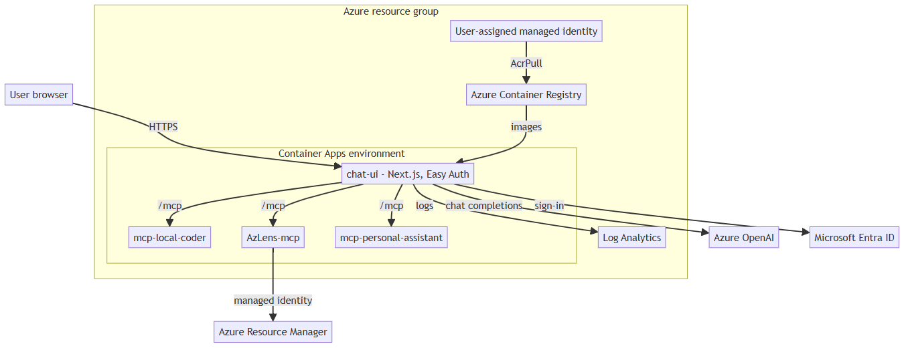

### Request flow (a single chat turn)

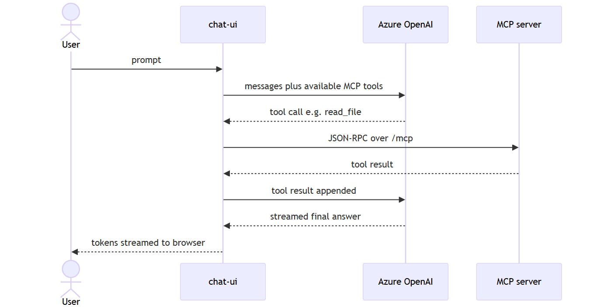

### CI/CD flow

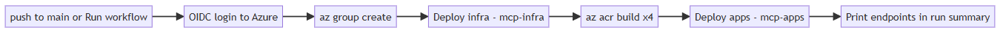

### Identity & authentication

Four distinct mechanisms: Easy Auth (users → chat-ui), API keys (chat-ui → model), `DefaultAzureCredential` + managed identity (AzLens → Azure), and OIDC federation (GitHub → Azure).

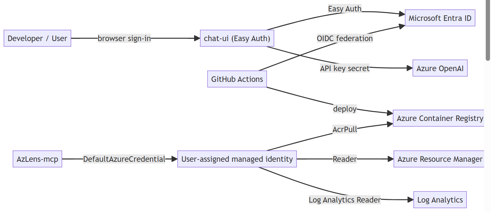

### Network & security boundaries

Only `chat-ui` is publicly exposed (behind Easy Auth); it fans out to the MCP servers and egresses to Azure OpenAI, ARM/Log Analytics, and Microsoft Learn.

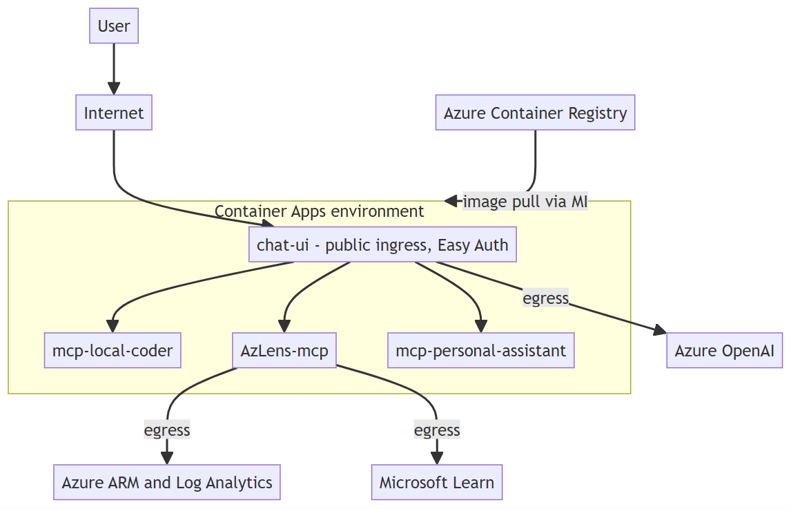

### Component / module map

Each MCP server's logic lives once in `server.ts` and is reused by the stdio and HTTP entry points; chat-ui's API routes act as the MCP client.

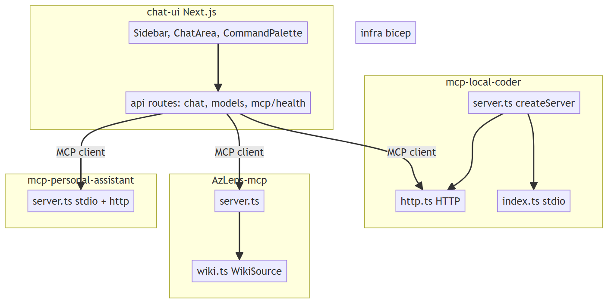

### Chat-turn lifecycle

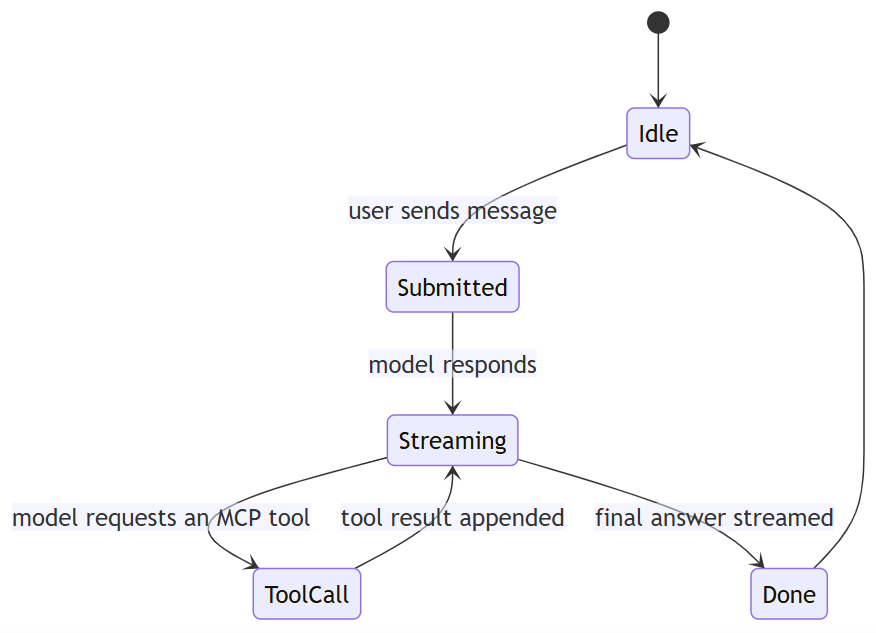

### `search_wiki` sources

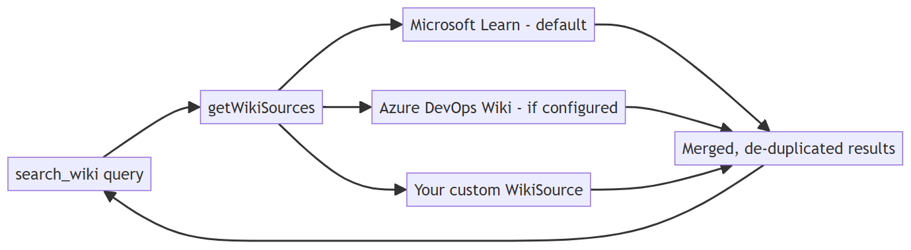

---

## Repository layout

```text
mcp-workspace/
├─ .github/workflows/deploy.yml     # provision + build + deploy pipeline
├─ infra/
│  ├─ main.bicep                    # environment, ACR, identity, 3 MCP apps + chat-ui
│  ├─ container-app.bicep           # reusable MCP container app module
│  └─ main.parameters.json          # default parameter values
├─ mcp-local-coder/                 # MCP server (files + code search)
│  ├─ src/{server,index,http}.ts    # factory / stdio / HTTP entry points
│  ├─ Dockerfile
│  └─ package.json
├─ AzLens-mcp/                      # MCP server (Azure ARM / KQL / Wiki)
├─ mcp-personal-assistant/          # MCP server (notes + to-do)
├─ chat-ui/                         # Next.js ChatGPT-style front end
│  ├─ app/{page,layout}.tsx
│  ├─ app/api/chat/route.ts         # Azure OpenAI + tool orchestration
│  ├─ lib/mcp.ts                    # aggregates MCP tools from all 3 servers
│  └─ Dockerfile
└─ claude_desktop_config.json       # local stdio client config
```

Each MCP server is fully isolated — its own `package.json`, dependencies, and build. Within a server, tool logic lives once in `src/server.ts` (`createServer()`), reused by both `index.ts` (stdio) and `http.ts` (HTTP).

---

## Prerequisites

| For                  | You need                                                                               |
| -------------------- | -------------------------------------------------------------------------------------- |
| Local development    | Node.js 18+ (20/22 LTS recommended), npm                                               |
| Deployment           | Azure subscription, [Azure CLI](https://learn.microsoft.com/cli/azure/), a GitHub repo |
| chat-ui              | An Azure OpenAI resource with a chat model deployment (e.g. `gpt-4o`)                  |
| Easy Auth (optional) | Permission to create a Microsoft Entra app registration                                |

---

## Quick start (local)

### 1. Build and run an MCP server (stdio)

```bash
cd mcp-local-coder
npm install
npm run build
npm start            # stdio transport — for Claude Desktop / VS Code
```

To expose it over HTTP instead:

```bash
npm run start:http   # Streamable HTTP on http://localhost:3000/mcp
```

### 2. Use the servers from a local MCP client

Point your client at [claude_desktop_config.json](claude_desktop_config.json) (replace the placeholder absolute paths). It maps all three servers over stdio.

### 3. Run the chat UI locally

Run each server on its own HTTP port, then start the UI:

```bash
# terminal 1
cd mcp-local-coder        && PORT=3001 npm run start:http
# terminal 2
cd AzLens-mcp             && PORT=3002 npm run start:http
# terminal 3
cd mcp-personal-assistant && PORT=3003 npm run start:http

# terminal 4
cd chat-ui
cp .env.example .env.local   # fill in Azure OpenAI + the MCP_*_URL values above
npm install
npm run dev                  # http://localhost:3000
```

---

## Running & testing locally (step by step)

These steps assume **Node.js 18+** is installed. Ordered fastest → most involved.

### Step 1 — Automated smoke test (fastest)

Spawns each server over stdio, lists its tools, and runs safe round-trips. Builds each server on first run.

```bash
npm install          # once, at the repo root
npm run smoke
```

Expected: `8/8 checks passed. Smoke test PASSED.` Use `SKIP_BUILD=1 npm run smoke` to skip rebuilds.

### Step 2 — Interactive tool testing (MCP Inspector)

The [MCP Inspector](https://github.com/modelcontextprotocol/inspector) is a browser UI to call tools by hand — no LLM required. Best for exploring a single server.

```bash
cd mcp-local-coder
npm install && npm run build
npx @modelcontextprotocol/inspector node build/index.js
```

Open the printed `http://localhost:6274` URL, click **Connect** → **List Tools**, and invoke `read_file` / `write_file` / `search_code`. Repeat for the other servers:

- `mcp-personal-assistant` — works offline; try `update_todo_list` then `get_daily_notes`.
- `AzLens-mcp` — `search_wiki` works offline; `query_azure_resource` / `run_kql_query` need `az login` and `AZURE_SUBSCRIPTION_ID` set.

Press Ctrl+C to stop.

### Step 3 — HTTP transport (what Azure runs)

```bash
cd mcp-local-coder
PORT=3001 npm run start:http
# in another terminal:
curl http://localhost:3001/health     # -> {"status":"ok"}
```

You can also point the Inspector at `http://localhost:3001/mcp` using the **Streamable HTTP** transport.

### Step 4 — Full end-to-end (chat UI)

Requires an **Azure OpenAI** resource + chat model deployment. Run the three servers on distinct ports, then the UI:

```bash
# three terminals
cd mcp-local-coder        && PORT=3001 npm run start:http
cd AzLens-mcp             && PORT=3002 npm run start:http
cd mcp-personal-assistant && PORT=3003 npm run start:http

# fourth terminal
cd chat-ui
cp .env.example .env.local   # set AZURE_OPENAI_* and MCP_*_URL to :3001/3002/3003
npm install
npm run dev                  # http://localhost:3000
```

Open http://localhost:3000 and try: _"read the file package.json"_, _"add 'ship v1' to my to-do list"_. Tool-call badges appear when a server is used. Easy Auth is an Azure-only feature, so the local UI is open — expected.

### Step 5 — Use from a local MCP client (stdio)

Point Claude Desktop / VS Code at [claude_desktop_config.json](claude_desktop_config.json), replacing the placeholder paths with your absolute `build/index.js` paths, then restart the client.

> **Recommended order:** Step 1 to confirm health, Step 2 to poke individual tools, then Step 4 once you have Azure OpenAI details.

---

## Configuration reference

All configuration is via environment variables. Locally use `.env` / `.env.local`; in Azure the Bicep template injects these (secrets are stored as Container Apps secrets).

### `mcp-local-coder`

| Variable         | Default             | Description                                            |
| ---------------- | ------------------- | ------------------------------------------------------ |
| `WORKSPACE_ROOT` | current working dir | Sandbox root; all file paths are constrained inside it |
| `PORT`           | `3000`              | HTTP port (HTTP transport only)                        |

### `AzLens-mcp`

| Variable                     | Default | Description                                                       |
| ---------------------------- | ------- | ----------------------------------------------------------------- |
| `AZURE_SUBSCRIPTION_ID`      | —       | Subscription queried by `query_azure_resource`                    |
| `LOG_ANALYTICS_WORKSPACE_ID` | —       | Default workspace for `run_kql_query`                             |
| `AZURE_CLIENT_ID`            | —       | Set by Bicep to the managed identity for `DefaultAzureCredential` |
| `PORT`                       | `3000`  | HTTP port                                                         |

Auth uses `DefaultAzureCredential`: `az login` locally, managed identity in Azure. No secrets are stored in code.

### `mcp-personal-assistant`

| Variable     | Default       | Description                                           |
| ------------ | ------------- | ----------------------------------------------------- |
| `NOTES_ROOT` | `~/mcp-notes` | Directory holding `YYYY-MM-DD.md` notes and `todo.md` |
| `PORT`       | `3000`        | HTTP port                                             |

### `mcp-github`

| Variable       | Default | Description                                                              |
| -------------- | ------- | ------------------------------------------------------------------------ |
| `GITHUB_TOKEN` | —       | Optional. Raises the rate limit (5000/h) and allows private-repo access. |
| `PORT`         | `3000`  | HTTP port                                                                |

### `chat-ui`

| Variable                       | Description                                                                                                                                                                        |
| ------------------------------ | ---------------------------------------------------------------------------------------------------------------------------------------------------------------------------------- |
| `CHAT_PROVIDER`                | Optional. Force a provider: `azure` / `openai` / `anthropic` / `local`. Otherwise auto-detected from whichever key is set.                                                         |
| `AZURE_OPENAI_RESOURCE_NAME`   | Azure OpenAI resource name (not the full URL)                                                                                                                                      |
| `AZURE_OPENAI_DEPLOYMENT`      | Chat model deployment name, e.g. `gpt-4o`                                                                                                                                          |
| `AZURE_OPENAI_API_VERSION`     | API version, e.g. `2024-10-21`                                                                                                                                                     |
| `AZURE_OPENAI_API_KEY`         | API key (a Container Apps secret in Azure)                                                                                                                                         |
| `OPENAI_API_KEY`               | Optional. Enables the OpenAI provider (`OPENAI_MODEL` to override the model).                                                                                                      |
| `ANTHROPIC_API_KEY`            | Optional. Enables the Anthropic provider (`ANTHROPIC_MODEL` to override the model).                                                                                                |
| `LOCAL_OPENAI_BASE_URL`        | Optional OpenAI-compatible endpoint (LM Studio / Ollama / vLLM), e.g. `http://localhost:1234/v1`. Enables a **Local** provider whose models are auto-discovered from `/v1/models`. |
| `LOCAL_MODEL`                  | Optional fallback local model id when `/v1/models` can't be reached; `LOCAL_OPENAI_API_KEY` / `LOCAL_LABEL` are also optional.                                                     |
| `AUTO_SIMPLE` / `AUTO_COMPLEX` | Optional overrides for the Auto router as `provider:model` (e.g. `anthropic:claude-3-5-sonnet-latest`).                                                                            |
| `MCP_LOCAL_CODER_URL`          | `mcp-local-coder` `/mcp` endpoint                                                                                                                                                  |
| `MCP_AZLENS_URL`               | `AzLens-mcp` `/mcp` endpoint                                                                                                                                                       |
| `MCP_PERSONAL_ASSISTANT_URL`   | `mcp-personal-assistant` `/mcp` endpoint                                                                                                                                           |
| `MCP_GITHUB_URL`               | `mcp-github` `/mcp` endpoint                                                                                                                                                       |

> Tool-approval mode is a per-browser UI setting (the **Approvals** toggle), not an environment variable.

---

## Deploy to Azure

The pipeline deploys **automatically on every push to `main`**, and can also be run manually — open the **Actions** tab, select **Provision and Deploy MCP Servers**, and click **Run workflow** (manual runs let you override the resource group, region, and name prefix):

**[▶ Run the deploy workflow](../../actions/workflows/deploy.yml)** _(replace with your repo URL)_

Either trigger provisions the infrastructure, builds & pushes all four container images to ACR, deploys the apps, and prints each endpoint in the run summary.

> A portal "Deploy to Azure" button is intentionally not used: these are container images that must be built and pushed to a registry, which the pipeline handles end-to-end.

### Step 1 — One-time Azure setup (OIDC)

The workflow logs in with **OIDC federation** — no client secrets stored in GitHub. Run once, replacing `<subscription-id>` and `<owner>/<repo>`:

```bash
# 1. App registration for the pipeline
appId=$(az ad app create --display-name "mcp-deploy" --query appId -o tsv)
az ad sp create --id "$appId"

# 2. Grant Owner on the subscription (Owner is required because the Bicep
#    creates an AcrPull role assignment; Contributor cannot do that).
az role assignment create --assignee "$appId" --role "Owner" \
  --scope "/subscriptions/<subscription-id>"

# 3. Federated credential for the main branch
az ad app federated-credential create --id "$appId" --parameters '{
  "name": "github-main",
  "issuer": "https://token.actions.githubusercontent.com",
  "subject": "repo:<owner>/<repo>:ref:refs/heads/main",
  "audiences": ["api://AzureADTokenExchange"]
}'

echo "AZURE_CLIENT_ID = $appId"
```

Add these **repository secrets** (Settings → Secrets and variables → Actions):

| Secret                  | Value                                     |
| ----------------------- | ----------------------------------------- |
| `AZURE_CLIENT_ID`       | the `appId` printed above                 |
| `AZURE_TENANT_ID`       | `az account show --query tenantId -o tsv` |
| `AZURE_SUBSCRIPTION_ID` | your subscription ID                      |

> If you run the workflow from a branch other than `main`, add a matching federated credential (`...:ref:refs/heads/<branch>`).

### Step 2 — chat-ui secrets (Azure OpenAI + Entra)

Add these repository secrets so the pipeline can configure the front end. Leave the `ENTRA_*` pair empty to deploy chat-ui **without** sign-in.

| Secret                       | Value                                       |
| ---------------------------- | ------------------------------------------- |
| `AZURE_OPENAI_RESOURCE_NAME` | Azure OpenAI resource name (not the URL)    |
| `AZURE_OPENAI_DEPLOYMENT`    | chat model deployment, e.g. `gpt-4o`        |
| `AZURE_OPENAI_API_KEY`       | key from the Azure OpenAI resource          |
| `ENTRA_CLIENT_ID`            | Entra app (client) ID that protects chat-ui |
| `ENTRA_CLIENT_SECRET`        | client secret for that Entra app            |

Create the Entra app that fronts chat-ui **after** the first deploy (so you know the chat-ui URL):

```bash
chatUrl=<chatUiUrl from deployment outputs>   # https://chat-ui.<region>.azurecontainerapps.io
appId=$(az ad app create --display-name "mcp-chat-ui" \
  --web-redirect-uris "$chatUrl/.auth/login/aad/callback" \
  --query appId -o tsv)
secret=$(az ad app credential reset --id "$appId" --query password -o tsv)
echo "ENTRA_CLIENT_ID = $appId"
echo "ENTRA_CLIENT_SECRET = $secret"
```

Add the two values as secrets and re-run the workflow to turn on Easy Auth.

### Step 3 — Run the deployment

Push to `main` (or click **Run workflow**). The pipeline:

1. logs in via OIDC,
2. creates the resource group,
3. deploys `infra/main.bicep` (`mcp-infra`) to create ACR + environment + identity,
4. builds and pushes the four images with `az acr build`,
5. redeploys (`mcp-apps`) with the real image tags,
6. prints the `chat-ui`, `mcp-local-coder`, `AzLens-mcp`, and `mcp-personal-assistant` URLs in the run summary.

### Step 4 — Post-deploy configuration

**AzLens permissions** — grant the managed identity read access to what it queries:

```bash
clientId=<managedIdentityClientId from deployment outputs>
az role assignment create --assignee "$clientId" --role "Reader" \
  --scope "/subscriptions/<subscription-id>"
az role assignment create --assignee "$clientId" --role "Log Analytics Reader" \
  --scope "<log-analytics-workspace-resource-id>"
```

**Easy Auth** — once `ENTRA_CLIENT_ID` / `ENTRA_CLIENT_SECRET` are set and the workflow re-runs, visiting the chat-ui URL redirects to Microsoft sign-in.

---

## Manual deploy (without GitHub Actions)

```bash
az group create -n rg-mcp -l eastus
az deployment group create -g rg-mcp -f infra/main.bicep -p infra/main.parameters.json

# build & push images, then redeploy with the real tags
acr=$(az deployment group show -g rg-mcp -n main --query properties.outputs.acrName.value -o tsv)
for app in mcp-local-coder:mcp-local-coder azlens-mcp:AzLens-mcp \
           mcp-personal-assistant:mcp-personal-assistant chat-ui:chat-ui; do
  img="${app%%:*}"; dir="${app##*:}"
  az acr build -r "$acr" -t "$img:latest" "./$dir"
done
```

Then re-run `az deployment group create` passing the `*Image` parameters (see the workflow for the exact list).

---

## Tools reference

| Server                 | Tool                   | Parameters                      | Description                                                                       |
| ---------------------- | ---------------------- | ------------------------------- | --------------------------------------------------------------------------------- |
| mcp-local-coder        | `read_file`            | `path`                          | Read a file inside `WORKSPACE_ROOT`                                               |
| mcp-local-coder        | `write_file`           | `path`, `content`               | Create/overwrite a file (dirs auto-created)                                       |
| mcp-local-coder        | `search_code`          | `query`                         | Recursive case-insensitive text search                                            |
| mcp-local-coder        | `list_directory`       | `path?`                         | List files/folders in a workspace directory                                       |
| AzLens-mcp             | `query_azure_resource` | `resourceId`                    | Fetch an ARM resource by ID (returns a clear hint if not authenticated)           |
| AzLens-mcp             | `run_kql_query`        | `workspaceId?`, `query`         | Run a KQL query against Log Analytics (returns a clear hint if not authenticated) |
| AzLens-mcp             | `search_wiki`          | `query`                         | Search docs — backed by Microsoft Learn; extensible to internal wikis             |
| mcp-personal-assistant | `get_daily_notes`      | `date` (YYYY-MM-DD)             | Read that day's markdown notes                                                    |
| mcp-personal-assistant | `update_todo_list`     | `task`, `status`                | Add/update a task (`todo`/`in-progress`/`done`)                                   |
| mcp-github             | `search_repositories`  | `query`, `limit?`               | Search public repositories with GitHub qualifiers                                 |
| mcp-github             | `get_repository`       | `owner`, `repo`                 | Repository details (stars, language, issues)                                      |
| mcp-github             | `list_issues`          | `owner`, `repo`, `state?`       | List issues (excludes PRs)                                                        |
| mcp-github             | `get_issue`            | `owner`, `repo`, `number`       | Fetch a single issue with its body                                                |
| mcp-github             | `list_pull_requests`   | `owner`, `repo`, `state?`       | List pull requests                                                                |
| mcp-github             | `get_file_contents`    | `owner`, `repo`, `path`, `ref?` | Read a text file from a repo                                                      |

> `write_file` and `update_todo_list` mutate state and are gated by **tool-approval mode** (on by default) — the model must get the user's confirmation before they run. Adjust the list in [chat-ui/lib/tools.ts](chat-ui/lib/tools.ts).

### MCP resources & prompts

Beyond tools, each server also exposes MCP **resources** (readable context) and **prompts** (reusable templates), surfaced in the chat-ui sidebar under **Prompts & resources**:

| Server                 | Prompts                          | Resources                                     |
| ---------------------- | -------------------------------- | --------------------------------------------- |
| mcp-local-coder        | `review-file`, `explain-code`    | `coder://workspace`                           |
| AzLens-mcp             | `diagnose-resource`, `write-kql` | `azlens://context`                            |
| mcp-personal-assistant | `plan-my-day`                    | `assistant://todo`, `assistant://notes/today` |
| mcp-github             | `triage-issue`, `summarize-repo` | `github://rate-limit`                         |

Clicking a prompt drafts its template into the composer (asking for any arguments); clicking a resource pulls its current content in as context.

---

## Chat UI functionality

The `chat-ui` front end is a full-featured, claude.ai-style client.

**Conversations**

- Multiple chats, persisted in the browser (localStorage) and switchable from the sidebar. Each chat remembers **its own agent and model** selection.
- Auto-generated titles from the first message; **double-click a chat to rename** it.
- **Pin** chats to a dedicated section; the rest are grouped by **Today / Yesterday / Previous 7 days / Older**.
- Delete individual chats or **Clear all chats**.
- **Export** a chat to Markdown or all chats to JSON, and **Import** chats back — from the command palette.

**Composing & responses**

- Streaming responses rendered as **Markdown** (headings, lists, tables, code blocks, links) via `react-markdown` + GFM.
- **File & image attachments** via the ＋ button (sent as `experimental_attachments`; images are understood by vision-capable models such as `gpt-4o`).
- Auto-growing composer — **Enter** sends, **Shift+Enter** inserts a newline.
- **Stop** a streaming response, **Regenerate** the last answer, **Copy** any reply, and **Edit & resend** a previous user message (which trims the turns after it).
- A small footer under each answer shows the agent, model, routed tier, and **token usage with an estimated cost** — using the provider's reported token counts when available, or a labelled `~approx` estimate (characters ÷ 4) otherwise.
- Tool calls render as **collapsible cards** showing the tool name, arguments, and result (click to expand).

**Models & routing**

- A **model picker** in the top bar lists only the providers configured on the server (Azure OpenAI / OpenAI / Anthropic / Local). The choice persists and is sent per message. A local OpenAI-compatible server (LM Studio, Ollama, vLLM) appears as **Local** when `LOCAL_OPENAI_BASE_URL` is set, with its loaded models discovered automatically.
- **Auto (route by complexity)** — the default option. A zero-cost heuristic scores each prompt and routes **simple** requests to a cheap/fast model and **complex** ones (code, multi-step reasoning, long or multi-part prompts) to the most capable model available. With a local model configured, simple prompts prefer the free **Local** model and complex prompts go to the best cloud model. The chosen agent, model, and tier are shown as a small badge above each answer. Override the picks with `AUTO_SIMPLE` / `AUTO_COMPLEX` (`provider:model`).
- **Routing resilience** — if Auto routes to a local server that is currently offline, it automatically falls back to the next available provider instead of failing the turn (the badge shows `· local offline`).

**Tool approval (human-in-the-loop)**

- The **Approvals** toggle in the top bar (on by default) requires explicit confirmation before **mutating** tools run (`write_file`, `update_todo_list`). When the model calls one, its `execute` is withheld server-side and the UI shows **Approve / Deny**; approving runs it via `POST /api/tool` and the model continues. Turn it off to let tools run automatically. Configure the sensitive-tool list in [chat-ui/lib/tools.ts](chat-ui/lib/tools.ts).

**Agents**

- An **agent picker** in the top bar switches between focused personas, each with a tailored system prompt and scoped to a subset of MCP servers:
  - **General** — all tools across every server.
  - **Code Assistant** — `mcp-local-coder` only (read/write/search code).
  - **Azure Expert** — `AzLens-mcp` only (resource queries, KQL, docs).
  - **Personal Assistant** — `mcp-personal-assistant` only (notes & to-dos).
- Add or edit agents in [chat-ui/lib/agents.ts](chat-ui/lib/agents.ts).

**MCP tools panel**

- Live **health dots** (online / down / off) for each server, polled every 15s via `/api/mcp/health`.
- **Click a server** to expand its tools; **click a tool** to draft an example prompt into the composer.

**Navigation & appearance**

- **⌘K / Ctrl+K command palette** — jump to any chat or run actions (new chat, toggle theme, export/import).
- **Dark mode** toggle (persisted).
- Collapsible sidebar that becomes a slim **icon rail**.
- **Search** to filter conversations.

**API routes (Next.js route handlers)**

| Route                 | Purpose                                                                                                                                                                                                                                                           |
| --------------------- | ----------------------------------------------------------------------------------------------------------------------------------------------------------------------------------------------------------------------------------------------------------------- |
| `POST /api/chat`      | Streams a completion; connects to the MCP servers as a client and exposes their tools to the model. Accepts an optional `{ provider, model, agentId }`. Resolves the agent (system prompt + server scope) and, for `provider: "auto"`, routes by task complexity. |
| `GET /api/models`     | Providers/models available, based on which API keys are configured on the server.                                                                                                                                                                                 |
| `POST /api/tool`      | Executes a single MCP tool after the user approves it in the UI (used by tool-approval mode).                                                                                                                                                                     |     | `GET /api/mcp/library` | Lists MCP **prompts** and **resources** across the servers.        |
| `POST /api/mcp/fetch` | Resolves a prompt template or reads a resource, returning text for the composer.                                                                                                                                                                                  |     | `GET /api/mcp/health`  | Server-side health check of each MCP server (avoids browser CORS). |

> `search_wiki` is implemented against **Microsoft Learn** and is extensible to internal wikis (e.g. an Azure DevOps project wiki) — see [AzLens-mcp/src/wiki.ts](AzLens-mcp/src/wiki.ts).

---

## How it works

**MCP servers (dual transport).** Each server's tool logic lives once in `src/server.ts` (`createServer()`), reused by `src/index.ts` (stdio) and `src/http.ts` (Streamable HTTP). The HTTP entry point runs an Express app exposing `POST` / `GET` / `DELETE` on `/mcp` with per-session `StreamableHTTPServerTransport` instances, plus `GET /health`.

**chat-ui as an MCP host.** The `/api/chat` route uses the Vercel AI SDK's `streamText` with tools aggregated from the MCP servers in scope for the selected **agent** (via `experimental_createMCPClient` over Streamable HTTP). For the **Auto** model option, a zero-cost heuristic ([chat-ui/lib/router.ts](chat-ui/lib/router.ts)) classifies each prompt and picks a cheap or powerful model, falling back to another provider if the chosen one (e.g. a local server) is offline. The model decides when to call a tool; read-only tools run automatically, while **mutating tools pause for approval** (their `execute` is withheld so the UI can confirm, then `POST /api/tool` runs them). Results feed back and the final answer streams out. Unreachable MCP servers are skipped so the chat still works without them.

**Authentication.**

- `AzLens-mcp` uses `DefaultAzureCredential` — `az login` locally, managed identity on Azure. The Azure tools pre-check authentication and return a clear hint if not signed in.
- `chat-ui` is protected by Microsoft Entra **Easy Auth** when deployed (configured in Bicep); model access uses provider API keys stored as Container Apps secrets.

**State.** Conversations and messages persist in the browser's localStorage — there is no server-side database. MCP HTTP sessions are in-memory per replica.

---

## Tooling & quality

- **Smoke tests** — `npm run smoke` (root) spawns each MCP server over stdio and exercises its tools.
- **Unit tests** — Vitest in-process tests for `mcp-local-coder` and `mcp-personal-assistant` (`npm test` in each), using the SDK's in-memory transport.
- **Lint & format** — ESLint (`npm run lint`) for the MCP servers, Prettier (`npm run format`), an `.editorconfig`, and a **Husky pre-commit** hook that runs `lint-staged` (formats staged files).
- **CI** ([.github/workflows/ci.yml](.github/workflows/ci.yml)) — smoke test, ESLint, per-project **build/typecheck + tests**, and **`bicep build`** on every pull request and push.
- **Security** — [CodeQL](.github/workflows/codeql.yml) code scanning, [Trivy](.github/workflows/security-scan.yml) image scanning of all four containers, and [Dependabot](.github/dependabot.yml) updates for npm, Docker, and GitHub Actions.
- **Observability** — set `APPLICATIONINSIGHTS_CONNECTION_STRING` and all four apps export traces, logs, and metrics to **Application Insights** via `@azure/monitor-opentelemetry` (servers: `src/telemetry.ts`; chat-ui: `instrumentation.ts`). The chat route also emits a custom **`chat.turn`** span per reply with the agent, provider, model, routed tier, and token counts. The Bicep provisions a workspace-based Application Insights resource and injects the connection string automatically. Leave it unset to disable.
- **Internal-only MCP option** — deploy with `mcpIngressExternal=false` to keep the MCP servers internal to the Container Apps environment (reachable only by `chat-ui`).

---

## Operations & hardening

- **Session state is in-memory per replica.** For `maxReplicas > 1`, enable session affinity or externalize sessions (e.g. Redis); otherwise a client's follow-up request may hit a replica that doesn't know the session.
- **Ephemeral storage.** `mcp-local-coder` (`/app/workspace`) and `mcp-personal-assistant` (`/app/notes`) write to the container's ephemeral disk. Mount an Azure Files volume for persistence.
- **MCP servers are publicly reachable.** Only `chat-ui` is behind Easy Auth. To restrict the MCP servers to the chat UI, switch their ingress to `internal` in the Bicep and use internal FQDNs.
- **Reproducible builds.** Run `npm install` in each project once, commit the `package-lock.json`, then switch the Dockerfiles from `npm install` to `npm ci`.
- **Least privilege.** Scope `WORKSPACE_ROOT` narrowly and grant `AzLens-mcp` only the RBAC roles it needs.

---

## Troubleshooting

| Symptom                                     | Likely cause / fix                                                                |
| ------------------------------------------- | --------------------------------------------------------------------------------- |
| Workflow fails at Azure login               | Federated credential subject doesn't match the branch, or missing repo secrets    |
| Deployment fails creating a role assignment | The pipeline identity needs **Owner** (or User Access Administrator) on the scope |
| chat-ui returns 500 on send                 | Missing/incorrect `AZURE_OPENAI_*` values, or the model deployment name is wrong  |
| chat-ui shows no tools                      | An `MCP_*_URL` is unreachable or not ending in `/mcp`                             |
| `AzLens-mcp` tool errors with auth          | Managed identity lacks Reader / Log Analytics Reader (see Step 4)                 |
| `az acr build` fails                        | Pipeline identity lacks push rights; Owner on the RG covers this                  |

### Architecture

#### Deployment topology

Everything runs in one Container Apps environment. A single user-assigned managed identity pulls images from ACR; AzLens-mcp also uses it to query Azure. Only chat-ui is exposed to users behind Entra Easy Auth.
